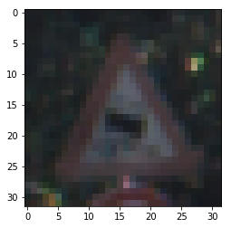
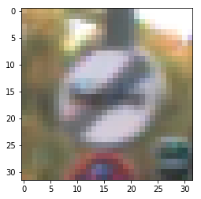
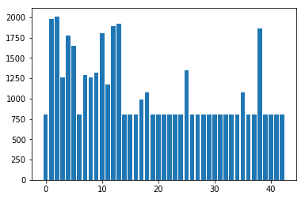
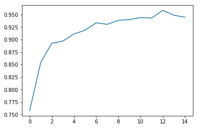
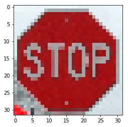
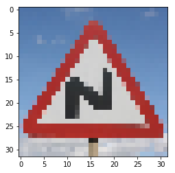
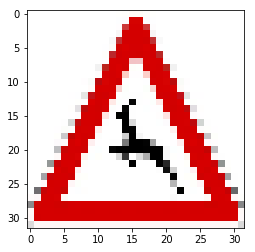
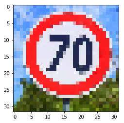
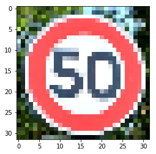

# Self-Driving Car Engineer Nanodegree

## Deep Learning

## Project: Build a Traffic Sign Recognition Classifier

In this notebook, a template is provided for you to implement your functionality in stages, which is required to successfully complete this project. If additional code is required that cannot be included in the notebook, be sure that the Python code is successfully imported and included in your submission if necessary. 

> **Note**: Once you have completed all of the code implementations, you need to finalize your work by exporting the iPython Notebook as an HTML document. Before exporting the notebook to html, all of the code cells need to have been run so that reviewers can see the final implementation and output. You can then export the notebook by using the menu above and navigating to  \n",
    "**File -> Download as -> HTML (.html)**. Include the finished document along with this notebook as your submission. 

In addition to implementing code, there is a writeup to complete. The writeup should be completed in a separate file, which can be either a markdown file or a pdf document. There is a [write up template](https://github.com/udacity/CarND-Traffic-Sign-Classifier-Project/blob/master/writeup_template.md) that can be used to guide the writing process. Completing the code template and writeup template will cover all of the [rubric points](https://review.udacity.com/#!/rubrics/481/view) for this project.

The [rubric](https://review.udacity.com/#!/rubrics/481/view) contains "Stand Out Suggestions" for enhancing the project beyond the minimum requirements. The stand out suggestions are optional. If you decide to pursue the "stand out suggestions", you can include the code in this Ipython notebook and also discuss the results in the writeup file.


>**Note:** Code and Markdown cells can be executed using the **Shift + Enter** keyboard shortcut. In addition, Markdown cells can be edited by typically double-clicking the cell to enter edit mode.

---
## Step 0: Load The Data


```python
!ls
```

    CODEOWNERS				  data
    German test images.zip			  environments.yml
    LICENSE					  examples
    README.md				  images
    Traffic_Sign_Classifier.ipynb		  signnames.csv
    Traffic_Sign_Classifier_1.ipynb		  traffic-signs-data.zip
    Traffic_Sign_Classifier_new.ipynb	  visualize_cnn.png
    Traffic_Sign_Classifier_new.ipynb 2	  writeup_template.md
    Traffic_Sign_Classifier_new_vishnu.ipynb


```python
# Load pickled data
import pickle
import numpy as np
import cv2

# TODO: Fill this in based on where you saved the training and testing data

training_file = "data/train.p"
validation_file = "data/valid.p"
testing_file = "data/test.p"

with open(training_file, mode='rb') as f:
    train = pickle.load(f)
with open(validation_file, mode='rb') as f:
    valid = pickle.load(f)
with open(testing_file, mode='rb') as f:
    test = pickle.load(f)
    
X_train, y_train_nh = train['features'], train['labels']
X_valid, y_valid_nh = valid['features'], valid['labels']
X_test, y_test_nh = test['features'], test['labels']
```


```python
import matplotlib.pyplot as plt
# Visualizations will be shown in the notebook.
%matplotlib inline
plt.figure()
plt.imshow(X_train[2000])
plt.figure()
plt.imshow(X_train[100])
```


    <matplotlib.image.AxesImage at 0x7f9cc23601d0>








```python
def random_scaling(img):
    rows, cols = img.shape[0:2]
    # points
    px = np.random.randint(-3,3)
    pts1 = np.float32([[px, px], [rows-px, px], [px, cols-px], [rows-px, cols-px]])
    pts2 = np.float32([[0,0], [rows, 0], [0, cols], [rows,cols]])
    M = cv2.getPerspectiveTransform(pts1, pts2)
    dst = cv2.warpPerspective(img, M, (rows,cols))
    dst = dst[:,:]
    return dst

def random_brightness(img):
    shifted = img + 1.0
    img_max_value = shifted.max()
    max_coef = 2.0/img_max_value
    min_coef = max_coef - 0.1
    coef = np.random.uniform(min_coef, max_coef)
    dst = shifted * coef - 1.0
```

### ---

## Step 1: Dataset Summary & Exploration

The pickled data is a dictionary with 4 key/value pairs:

- `'features'` is a 4D array containing raw pixel data of the traffic sign images, (num examples, width, height, channels).
- `'labels'` is a 1D array containing the label/class id of the traffic sign. The file `signnames.csv` contains id -> name mappings for each id.
- `'sizes'` is a list containing tuples, (width, height) representing the original width and height the image.
- `'coords'` is a list containing tuples, (x1, y1, x2, y2) representing coordinates of a bounding box around the sign in the image. **THESE COORDINATES ASSUME THE ORIGINAL IMAGE. THE PICKLED DATA CONTAINS RESIZED VERSIONS (32 by 32) OF THESE IMAGES**

Complete the basic data summary below. Use python, numpy and/or pandas methods to calculate the data summary rather than hard coding the results. For example, the [pandas shape method](http://pandas.pydata.org/pandas-docs/stable/generated/pandas.DataFrame.shape.html) might be useful for calculating some of the summary results. 

### Provide a Basic Summary of the Data Set Using Python, Numpy and/or Pandas


```python
### Replace each question mark with the appropriate value. 
### Use python, pandas or numpy methods rather than hard coding the results

# TODO: Number of training examples
n_train = X_train.shape[0]

# TODO: Number of validation examples
n_validation = X_valid.shape[0]

# TODO: Number of testing examples.
n_test = X_test.shape[0]

# TODO: What's the shape of an traffic sign image?
image_shape = X_train.shape[1:3]

print("Number of training examples =", n_train)
print("Number of testing examples =", n_test)
print("Image data shape =", image_shape)
```

    Number of training examples = 34799
    Number of testing examples = 12630
    Image data shape = (32, 32)


```python
from skimage import color
from sklearn.utils import shuffle

X_train = np.asarray([color.rgb2gray(X_train[i]) for i in range(n_train)])
X_valid = np.asarray([color.rgb2gray(X_valid[i]) for i in range(n_validation)])
X_test = np.asarray([color.rgb2gray(X_test[i]) for i in range(n_test)])
print(X_train.shape)
print(X_valid.shape)
print(X_test.shape)
```

    (34799, 32, 32)
    (4410, 32, 32)
    (12630, 32, 32)


```python
# Normalizing training, testing and validation data
X_train = ((X_train-0.5)/0.5)
X_valid = ((X_valid-0.5)/0.5)
X_test = ((X_test-0.5)/0.5)
```


```python
n_classes = y_train_nh.max()+1
print(n_classes)
```

    43


```python
# improving training data
import os.path
if os.path.isfile("Training_data_label.npz"):
    training_x_y = np.load("Training_data_label.npz")
    X_train = training_x_y['X_train']
    y_train_nh = training_x_y['y_train_nh']
else:
    average_samples = 800
    for class_i in range(n_classes):
        class_indices = np.where(y_train_nh==class_i)[0]
        n_samples = len(class_indices)
        if n_samples <= average_samples:
            for i in range(average_samples-n_samples):
                print(class_i, i*100/(average_samples-n_samples), end='\r', flush=True)
                new_img = X_train[class_indices[i%n_samples]]
    #             new_img = random_scaling(new_img)
    #             print(new_img.shape)
                X_train = np.append(X_train, [new_img], axis=0)
                y_train_nh = np.hstack([y_train_nh, class_i])
    print("Completed...")
    np.savez("Training_data_label.npz", X_train=X_train, y_train_nh=y_train_nh)
```


```python
np.savez("Training_data_label.npz", X_train=X_train, y_train_nh=y_train_nh)
```


```python

```

    (46480, 32, 32)


```python
def encoder(data):
    n_data = data.shape[0]
    n_classes = len(list(range(data.min(), data.max()+1)))
    output = np.zeros((n_data, n_classes))
    for i in range(0, n_data):
        output[i][data[i]] = 1
    return output
```


```python
y_train = encoder(y_train_nh)
y_valid = encoder(y_valid_nh)
y_test = encoder(y_test_nh)
```


```python
### Replace each question mark with the appropriate value. 
### Use python, pandas or numpy methods rather than hard coding the results

# TODO: Number of training examples
n_train = X_train.shape[0]
# TODO: How many unique classes/labels there are in the dataset.
n_classes = y_train[0].shape[0]
print("Number of training examples =", n_train)
print("Number of classes = ", n_classes)
```

    Number of training examples = 46480
    Number of classes =  43


```python
y_training_hist = np.sum(y_train, axis=0)
plt.bar(np.arange(0,43),y_training_hist)
print(y_training_hist)
print(np.mean(y_training_hist))
```

    [  800.  1980.  2010.  1260.  1770.  1650.   800.  1290.  1260.  1320.
      1800.  1170.  1890.  1920.   800.   800.   800.   990.  1080.   800.
       800.   800.   800.   800.   800.  1350.   800.   800.   800.   800.
       800.   800.   800.   800.   800.  1080.   800.   800.  1860.   800.
       800.   800.   800.]
    1080.93023256





### Include an exploratory visualization of the dataset

Visualize the German Traffic Signs Dataset using the pickled file(s). This is open ended, suggestions include: plotting traffic sign images, plotting the count of each sign, etc. 

The [Matplotlib](http://matplotlib.org/) [examples](http://matplotlib.org/examples/index.html) and [gallery](http://matplotlib.org/gallery.html) pages are a great resource for doing visualizations in Python.

**NOTE:** It's recommended you start with something simple first. If you wish to do more, come back to it after you've completed the rest of the sections. It can be interesting to look at the distribution of classes in the training, validation and test set. Is the distribution the same? Are there more examples of some classes than others?


```python
### Data exploration visualization code goes here.
### Feel free to use as many code cells as needed.
```

----

## Step 2: Design and Test a Model Architecture

Design and implement a deep learning model that learns to recognize traffic signs. Train and test your model on the [German Traffic Sign Dataset](http://benchmark.ini.rub.de/?section=gtsrb&subsection=dataset).

The LeNet-5 implementation shown in the [classroom](https://classroom.udacity.com/nanodegrees/nd013/parts/fbf77062-5703-404e-b60c-95b78b2f3f9e/modules/6df7ae49-c61c-4bb2-a23e-6527e69209ec/lessons/601ae704-1035-4287-8b11-e2c2716217ad/concepts/d4aca031-508f-4e0b-b493-e7b706120f81) at the end of the CNN lesson is a solid starting point. You'll have to change the number of classes and possibly the preprocessing, but aside from that it's plug and play! 

With the LeNet-5 solution from the lecture, you should expect a validation set accuracy of about 0.89. To meet specifications, the validation set accuracy will need to be at least 0.93. It is possible to get an even higher accuracy, but 0.93 is the minimum for a successful project submission. 

There are various aspects to consider when thinking about this problem:

- Neural network architecture (is the network over or underfitting?)
- Play around preprocessing techniques (normalization, rgb to grayscale, etc)
- Number of examples per label (some have more than others).
- Generate fake data.

Here is an example of a [published baseline model on this problem](http://yann.lecun.com/exdb/publis/pdf/sermanet-ijcnn-11.pdf). It's not required to be familiar with the approach used in the paper but, it's good practice to try to read papers like these.

### Pre-process the Data Set (normalization, grayscale, etc.)

Minimally, the image data should be normalized so that the data has mean zero and equal variance. For image data, `(pixel - 128)/ 128` is a quick way to approximately normalize the data and can be used in this project. 

Other pre-processing steps are optional. You can try different techniques to see if it improves performance. 

Use the code cell (or multiple code cells, if necessary) to implement the first step of your project.


```python
print(X_train.min())
```

    -0.974238431373


```python
### Preprocess the data here. It is required to normalize the data. Other preprocessing steps could include 
### converting to grayscale, etc.
### Feel free to use as many code cells as needed.
```


```python
print(np.std(X_train))
print(X_train.max())
print(X_train.min())
```

    0.514514718422
    1.0
    -0.974238431373


### Model Architecture


```python
### Define your architecture here.
### Feel free to use as many code cells as needed.
from tensorflow.contrib.layers import flatten
import tensorflow as tf

def LeNet(x):
    # Arguments used for tf.truncated_normal, randomly defines variables for the weights and biases for each layer
    mu = 0
    sigma = 0.5
    
    # SOLUTION: Layer 1: Convolutional. Input = 32x32x1. Output = 28x28x6.
    conv1_W = tf.Variable(tf.truncated_normal(shape=(5, 5, 1, 6), mean = mu, stddev = sigma))
    conv1_b = tf.Variable(tf.zeros(6))
    conv1   = tf.nn.conv2d(x, conv1_W, strides=[1, 1, 1, 1], padding='VALID') + conv1_b

    # SOLUTION: Activation.
    conv1 = tf.nn.relu(conv1)

    # SOLUTION: Pooling. Input = 28x28x6. Output = 14x14x6.
    conv1 = tf.nn.max_pool(conv1, ksize=[1, 2, 2, 1], strides=[1, 2, 2, 1], padding='VALID')

    # SOLUTION: Layer 2: Convolutional. Output = 10x10x16.
    conv2_W = tf.Variable(tf.truncated_normal(shape=(5, 5, 6, 16), mean = mu, stddev = sigma))
    conv2_b = tf.Variable(tf.zeros(16))
    conv2   = tf.nn.conv2d(conv1, conv2_W, strides=[1, 1, 1, 1], padding='VALID') + conv2_b
    
    # SOLUTION: Activation.
    conv2 = tf.nn.relu(conv2)

    # SOLUTION: Pooling. Input = 10x10x16. Output = 5x5x16.
    conv2 = tf.nn.max_pool(conv2, ksize=[1, 2, 2, 1], strides=[1, 2, 2, 1], padding='VALID')

    # SOLUTION: Flatten. Input = 5x5x16. Output = 400.
    fc0   = flatten(conv2)
    
    # SOLUTION: Layer 3: Fully Connected. Input = 400. Output = 120.
    fc1_W = tf.Variable(tf.truncated_normal(shape=(400, 120), mean = mu, stddev = sigma))
    fc1_b = tf.Variable(tf.zeros(120))
    fc1   = tf.matmul(fc0, fc1_W) + fc1_b
    
    # SOLUTION: Activation.
    fc1    = tf.nn.relu(fc1)

    # SOLUTION: Layer 4: Fully Connected. Input = 120. Output = 84.
    fc2_W  = tf.Variable(tf.truncated_normal(shape=(120, 84), mean = mu, stddev = sigma))
    fc2_b  = tf.Variable(tf.zeros(84))
    fc2    = tf.matmul(fc1, fc2_W) + fc2_b
    
    # SOLUTION: Activation.
    fc2    = tf.nn.relu(fc2)

    # SOLUTION: Layer 5: Fully Connected. Input = 84. Output = 43.
    fc3_W  = tf.Variable(tf.truncated_normal(shape=(84, 43), mean = mu, stddev = sigma))
    fc3_b  = tf.Variable(tf.zeros(43))
    logits = tf.matmul(fc2, fc3_W) + fc3_b
    
    return logits
```


```python
def signRecNet(x,lf1 = 8,lf2 = 16,lf3 = 32, lf4 = 32):    
    # Arguments used for tf.truncated_normal, randomly defines variables for the weights and biases for each layer
    mu = 0
    sigma = 0.1
    #print(x)
    
    #print('ConvNet Architecture:')

    # Reshape from 2D to 4D. This prepares the data for
    # convolutional and pooling layers.
    #x = tf.reshape(x, (-1, 28, 28, 1))
    # Pad 0s to 32x32. Centers the digit further.
    # Add 2 rows/columns on each side for height and width dimensions.
    #x = tf.pad(x, [[0, 0], [2, 2], [2, 2], [0, 0]], mode="CONSTANT")   
    #print(x)
    
    # TODO: Layer 1: Convolutional. Input = 32x32x1. Output = 28x28x6.
    W_C1=tf.Variable(tf.truncated_normal((5,5,1,lf1),mu,sigma))
    B_C1=tf.Variable(tf.zeros(lf1,1))
    C1=tf.nn.conv2d(x,W_C1,[1,1,1,1],'VALID')+B_C1
    AC1=tf.nn.relu(C1)
    # Input = 28x28x6. Output = 24x24x6.
    W_C2=tf.Variable(tf.truncated_normal((5,5,lf1,lf2),mu,sigma))
    B_C2=tf.Variable(tf.zeros(lf2,1))
    C2=tf.nn.conv2d(AC1,W_C2,[1,1,1,1],'VALID')+B_C2
    AC2=tf.nn.relu(C2)
    
    # Input = 24x24xN. Output = 12x12xN
    P1=tf.nn.max_pool(AC2,[1,2,2,1],[1,2,2,1],'VALID')
    
    DROP1=tf.nn.dropout(P1,keep_prob = 0.8)
    
    # Input = 12x12xN. Output = 10x10xN.
    W_C3=tf.Variable(tf.truncated_normal((3,3,lf2,lf3),mu,sigma))
    B_C3=tf.Variable(tf.zeros(lf3,1))
    C3=tf.nn.conv2d(DROP1,W_C3,[1,1,1,1],'VALID')+B_C3
    AC3=tf.nn.relu(C3)
    # Input = 10x10x6. Output = 8x8x6.
    W_C4=tf.Variable(tf.truncated_normal((3,3,lf3,lf4),mu,sigma))
    B_C4=tf.Variable(tf.zeros(lf4,1))
    C4=tf.nn.conv2d(AC3,W_C4,[1,1,1,1],'VALID')+B_C4
    AC4=tf.nn.relu(C4)
    
    #Input = 8x8xN. Output = 4x4xN
    P2=tf.nn.max_pool(AC4,[1,2,2,1],[1,2,2,1],'VALID')

    # TODO: Flatten. Input = 4x4x16. Output = 400.
    FL = tf.contrib.layers.flatten(P2,[1,4*4*lf4])
    #print(FL)
    # TODO: Layer 3: Fully Connected. Input = 400. Output = 120.
    #FC1 = tf.contrib.layers.fully_connected(FL,[400,120])
    #DROP1=tf.nn.dropout(FL,0.5)
    
    #DROP2=tf.nn.dropout(FL,keep_prob = 0.6)
    
    W_FC1=tf.Variable(tf.truncated_normal((4*4*lf4,120),mu,sigma))
    B_FC1=tf.Variable(tf.zeros(120,1))
    FC1 = (tf.matmul(FL,W_FC1)+B_FC1)
    #print(FC1)
    # TODO: Activation.
    AC4=tf.nn.relu(FC1)
    #print(AC4)
    # TODO: Layer 4: Fully Connected. Input = 120. Output = 84.
    
    DROP3=tf.nn.dropout(AC4,keep_prob = 0.5)
    
    W_FC2=tf.Variable(tf.truncated_normal((120,84),mu,sigma))
    B_FC2=tf.Variable(tf.zeros(84,1))
    FC2 = (tf.matmul(DROP3,W_FC2)+B_FC2)
    #print(FC2)
    # TODO: Activation.
    AC5=tf.nn.relu(FC2)
    #print(AC5)
    # TODO: Layer 5: Fully Connected. Input = 84. Output = 43.
    W_FC3=tf.Variable(tf.truncated_normal((84,43),mu,sigma))
    B_FC3=tf.Variable(tf.zeros(43,1))
    FC3 = (tf.matmul(AC5,W_FC3)+B_FC3)
    #print(FC3)
    logits=FC3
    
    return logits

```


```python
x = tf.placeholder(tf.float32, (None, 32, 32, 1))
y = tf.placeholder(tf.int32, (None, n_classes))


EPOCHS = 15
BATCH_SIZE = 128
```

### Train, Validate and Test the Model

A validation set can be used to assess how well the model is performing. A low accuracy on the training and validation
sets imply underfitting. A high accuracy on the training set but low accuracy on the validation set implies overfitting.


```python
### Train your model here.
### Calculate and report the accuracy on the training and validation set.
### Once a final model architecture is selected, 
### the accuracy on the test set should be calculated and reported as well.
### Feel free to use as many code cells as needed.
rate = 0.001

logits = signRecNet(x)
cross_entropy = tf.nn.softmax_cross_entropy_with_logits(labels=y, logits=logits)
loss_operation = tf.reduce_mean(cross_entropy)
optimizer = tf.train.AdamOptimizer(learning_rate = rate)
training_operation = optimizer.minimize(loss_operation)
```

    WARNING:tensorflow:From <ipython-input-21-e41bc8ce08a1>:9: softmax_cross_entropy_with_logits (from tensorflow.python.ops.nn_ops) is deprecated and will be removed in a future version.
    Instructions for updating:
    
    Future major versions of TensorFlow will allow gradients to flow
    into the labels input on backprop by default.
    
    See @{tf.nn.softmax_cross_entropy_with_logits_v2}.
    


```python
correct_prediction = tf.equal(tf.argmax(logits, 1), tf.argmax(y, 1))
accuracy_operation = tf.reduce_mean(tf.cast(correct_prediction, tf.float32))
saver = tf.train.Saver()

def evaluate(X_data, y_data):
    num_examples = len(X_data)
    total_accuracy = 0
    sess = tf.get_default_session()
    for offset in range(0, num_examples, BATCH_SIZE):
        batch_x, batch_y = X_data[offset:offset+BATCH_SIZE], y_data[offset:offset+BATCH_SIZE]
        n = batch_x.shape[0]
        batch_x = batch_x.reshape(n,32,32,1)
        accuracy = sess.run(accuracy_operation, feed_dict={x: batch_x, y: batch_y})
        total_accuracy += (accuracy * len(batch_x))
    return total_accuracy / num_examples
```


```python
validation_accuracy = []
with tf.Session() as sess:
    sess.run(tf.global_variables_initializer())
    num_examples = len(X_train)
    
    print("Training...")
    print()
    for i in range(EPOCHS):
        X_train, y_train = shuffle(X_train, y_train)
        for offset in range(0, num_examples, BATCH_SIZE):
            end = offset + BATCH_SIZE
            batch_x, batch_y = X_train[offset:end], y_train[offset:end]
            n = batch_x.shape[0]
            batch_x = batch_x.reshape(n,32,32,1)
            sess.run(training_operation, feed_dict={x: batch_x, y: batch_y})
            
        validation_accuracy.append(evaluate(X_valid, y_valid))
        print("EPOCH {} ...".format(i+1))
        print("Validation Accuracy = {:.3f}".format(validation_accuracy[i]))
    saver.save(sess, './lenet')
    print("Model saved!")

plt.plot(np.arange(EPOCHS), validation_accuracy)
plt.show()
```

    Training...
    
    EPOCH 1 ...
    Validation Accuracy = 0.758
    EPOCH 2 ...
    Validation Accuracy = 0.854
    EPOCH 3 ...
    Validation Accuracy = 0.893
    EPOCH 4 ...
    Validation Accuracy = 0.897
    EPOCH 5 ...
    Validation Accuracy = 0.911
    EPOCH 6 ...
    Validation Accuracy = 0.919
    EPOCH 7 ...
    Validation Accuracy = 0.934
    EPOCH 8 ...
    Validation Accuracy = 0.931
    EPOCH 9 ...
    Validation Accuracy = 0.939
    EPOCH 10 ...
    Validation Accuracy = 0.940
    EPOCH 11 ...
    Validation Accuracy = 0.944
    EPOCH 12 ...
    Validation Accuracy = 0.943
    EPOCH 13 ...
    Validation Accuracy = 0.959
    EPOCH 14 ...
    Validation Accuracy = 0.949
    EPOCH 15 ...
    Validation Accuracy = 0.945
    Model saved!





```python
with tf.Session() as sess:
    saver.restore(sess, tf.train.latest_checkpoint('.'))
    Test_accuracy = evaluate(X_test, y_test)
    print("Test Accuracy = {:.3f}".format(Test_accuracy))
```

    INFO:tensorflow:Restoring parameters from ./lenet
    Test Accuracy = 0.927


---

## Step 3: Test a Model on New Images

To give yourself more insight into how your model is working, download at least five pictures of German traffic signs from the web and use your model to predict the traffic sign type.

You may find `signnames.csv` useful as it contains mappings from the class id (integer) to the actual sign name.

### Load and Output the Images


```python
import glob

images = [cv2.resize(cv2.cvtColor(cv2.imread(path), cv2.COLOR_BGR2RGB), (32,32)) for path in glob.glob('images/*.jpg')]
test_images=np.asarray([(color.rgb2gray(cv2.resize(cv2.imread(path), (32,32)))-0.5)/0.5 for path in glob.glob('images/*.jpg')]).astype("float32")
test_images = test_images.reshape(5,32,32,1)
for i in range(len(images)):
    plt.figure()
    plt.imshow(images[i])
```

















### Predict the Sign Type for Each Image


```python
import pandas as pd
signnames = pd.read_csv("signnames.csv")
print(signnames)
```

        ClassId                                           SignName
    0         0                               Speed limit (20km/h)
    1         1                               Speed limit (30km/h)
    2         2                               Speed limit (50km/h)
    3         3                               Speed limit (60km/h)
    4         4                               Speed limit (70km/h)
    5         5                               Speed limit (80km/h)
    6         6                        End of speed limit (80km/h)
    7         7                              Speed limit (100km/h)
    8         8                              Speed limit (120km/h)
    9         9                                         No passing
    10       10       No passing for vehicles over 3.5 metric tons
    11       11              Right-of-way at the next intersection
    12       12                                      Priority road
    13       13                                              Yield
    14       14                                               Stop
    15       15                                        No vehicles
    16       16           Vehicles over 3.5 metric tons prohibited
    17       17                                           No entry
    18       18                                    General caution
    19       19                        Dangerous curve to the left
    20       20                       Dangerous curve to the right
    21       21                                       Double curve
    22       22                                         Bumpy road
    23       23                                      Slippery road
    24       24                          Road narrows on the right
    25       25                                          Road work
    26       26                                    Traffic signals
    27       27                                        Pedestrians
    28       28                                  Children crossing
    29       29                                  Bicycles crossing
    30       30                                 Beware of ice/snow
    31       31                              Wild animals crossing
    32       32                End of all speed and passing limits
    33       33                                   Turn right ahead
    34       34                                    Turn left ahead
    35       35                                         Ahead only
    36       36                               Go straight or right
    37       37                                Go straight or left
    38       38                                         Keep right
    39       39                                          Keep left
    40       40                               Roundabout mandatory
    41       41                                  End of no passing
    42       42  End of no passing by vehicles over 3.5 metric ...


```python
### Run the predictions here and use the model to output the prediction for each image.
### Make sure to pre-process the images with the same pre-processing pipeline used earlier.
### Feel free to use as many code cells as needed.

with tf.Session() as sess:
    saver.restore(sess, tf.train.latest_checkpoint('.'))
    prediction = sess.run(logits, feed_dict={x:test_images})
    print(signnames["SignName"][np.argmax(prediction, axis=1)])
    predicted_array = np.argmax(prediction, axis=1)
```

    INFO:tensorflow:Restoring parameters from ./lenet
    14                     Stop
    23            Slippery road
    31    Wild animals crossing
    2      Speed limit (50km/h)
    2      Speed limit (50km/h)
    Name: SignName, dtype: object


### Analyze Performance


```python
### Calculate the accuracy for these 5 new images. 
### For example, if the model predicted 1 out of 5 signs correctly, it's 20% accurate on these new images.
web_images_label_ID = [14, 21, 31, 4, 2]
correct_pred = len(predicted_array[predicted_array==web_images_label_ID])
Accuracy_in_web_prediction = correct_pred/len(web_images_label_ID)*100
print("Accuracy in prediction of web images: {} %.".format(Accuracy_in_web_prediction))
```

    Accuracy in prediction of web images: 60.0 %.


### Output Top 5 Softmax Probabilities For Each Image Found on the Web

For each of the new images, print out the model's softmax probabilities to show the **certainty** of the model's predictions (limit the output to the top 5 probabilities for each image). [`tf.nn.top_k`](https://www.tensorflow.org/versions/r0.12/api_docs/python/nn.html#top_k) could prove helpful here. 

The example below demonstrates how tf.nn.top_k can be used to find the top k predictions for each image.

`tf.nn.top_k` will return the values and indices (class ids) of the top k predictions. So if k=3, for each sign, it'll return the 3 largest probabilities (out of a possible 43) and the correspoding class ids.

Take this numpy array as an example. The values in the array represent predictions. The array contains softmax probabilities for five candidate images with six possible classes. `tf.nn.top_k` is used to choose the three classes with the highest probability:

```
# (5, 6) array
a = np.array([[ 0.24879643,  0.07032244,  0.12641572,  0.34763842,  0.07893497,
         0.12789202],
       [ 0.28086119,  0.27569815,  0.08594638,  0.0178669 ,  0.18063401,
         0.15899337],
       [ 0.26076848,  0.23664738,  0.08020603,  0.07001922,  0.1134371 ,
         0.23892179],
       [ 0.11943333,  0.29198961,  0.02605103,  0.26234032,  0.1351348 ,
         0.16505091],
       [ 0.09561176,  0.34396535,  0.0643941 ,  0.16240774,  0.24206137,
         0.09155967]])
```

Running it through `sess.run(tf.nn.top_k(tf.constant(a), k=3))` produces:

```
TopKV2(values=array([[ 0.34763842,  0.24879643,  0.12789202],
       [ 0.28086119,  0.27569815,  0.18063401],
       [ 0.26076848,  0.23892179,  0.23664738],
       [ 0.29198961,  0.26234032,  0.16505091],
       [ 0.34396535,  0.24206137,  0.16240774]]), indices=array([[3, 0, 5],
       [0, 1, 4],
       [0, 5, 1],
       [1, 3, 5],
       [1, 4, 3]], dtype=int32))
```

Looking just at the first row we get `[ 0.34763842,  0.24879643,  0.12789202]`, you can confirm these are the 3 largest probabilities in `a`. You'll also notice `[3, 0, 5]` are the corresponding indices.


```python
### Print out the top five softmax probabilities for the predictions on the German traffic sign images found on the web. 
### Feel free to use as many code cells as needed.
with tf.Session() as sess:
    most_probable = sess.run(tf.nn.top_k(tf.constant(prediction), k=5))

print("The first 5 most probable predictions are :")
print(most_probable[1])
print(" ")
print("Top five softmax probabilities of the predictions are :")
print(most_probable[0])
```

    The first 5 most probable predictions are :
    [[14  5  1  2  4]
     [23 20 28  3 30]
     [31 11 23 20 18]
     [ 2  3 25 31  5]
     [ 2  1  5  3 10]]
     
    Top five softmax probabilities of the predictions are :
    [[  5.89644003   5.78594303   4.55727625   1.83468604   1.77240825]
     [ 17.56988335  10.18706036   6.48295927   2.8008008    2.32466483]
     [ 16.79135513  15.20259666  12.77282429  12.29170799   8.42282104]
     [  7.62908077   5.56084538   4.96197796   2.62537622   2.51083159]
     [ 47.97433853  21.87446976  18.9687748   13.142272     8.25007248]]

